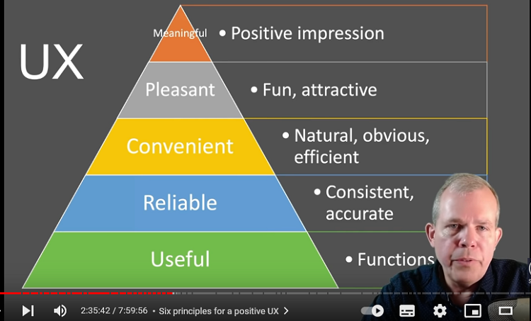
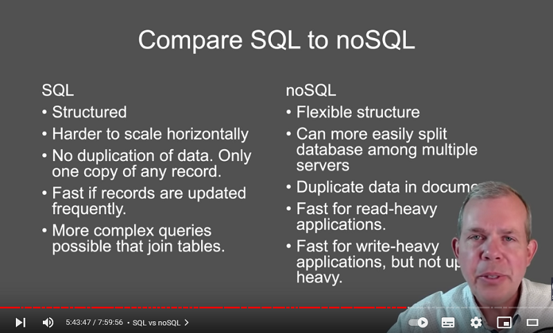

# Business of Building Apps

<h2 style="color:grey; font-weight:bold; margin-top: 1rem">Motivations for building an app</h2>

<details>
<summary>Motivations for building an app</summary>

<details>
<summary>Motivations</summary>

- Why and app?

```js
// - money
// - save the world
// - improve people life
// - gov work better
// - ...
```

- What problem are you going to solve?

```js
// There's an app for every need, but not a need for every app.
```

- Value proposition

```js
// airBnb => Enable property owners to make money by renting space.
// X is a service that allows Y(cutomer) to do Z in a better way.
```

-App or website ?

```js
// - Majority of people play games App
// - On the other side, they use web brower to navigate through web pages
```

<details>
<summary>Categories of Apps</summary>

```js
// compare to others
// find your customer = make greats app they love to use = money

// augment instead of replace => app improving another Big app

// --- categories ---
// make games, for portfolio
// lifestyle
// utility
// productivity
// shopping => augment rather than compete against Big
// news & informations
// education
```

choosing a category

```js
// 1 - pick something you love = know things you love and gotta do !== harder to solver others problems
// 2 - focus on satisfaction rather than money
// 3 - improve existing app rather than compete against big ones
```

</details>

</details>

<details>
<summary>Find a problem to solve
</summary>

```js
// "An idea that does not fulfill a need is not a business opportunity"
```

```js
// "We divide business plans into three categories: candy, vitamins, and painkillers.
// We throw away the candy.
// We look at vitamins.
// We really luke painkillers.
// We espacially like addictive painkillers."
```

```js
// Candy => fun, wasting time but like it
// Vitamins => cool idea, could probably use it. Nice to have
// Painkillers => need it now, shut up and take my money
```

```js
// seek for higher needs , fullfilment , belonging , recognition , security
```

Five whys

```js
// - why is it happening ? why is that? why is that? why is that? why is that ?
```

</details>

<details>

<summary>Discover a niche</summary>

```js
// low competition
// market demand
// profit potential

 - Follow trends
//  google trends - ex: keywords by year

- Add a twist
// combine features => ex: google map + police check => waze
```

- Improve existing

```js
// compare competitors : popularity , notable features, monetization, company size, update, reviews
// features : gap to fill ?
// monetization : people annoyed ?
// size: competing against Big team or solo programmer ?
// updates: updated good app ?
// poor ratings ? a lot of people but existing bad app
// good ratings ? build similar app/features
```

apps stats

```js
// appannie
// sensorTower
// statista
```

</details>

<details>
<summary>The Elevator pitch - Listen to your users</summary>

```js
// share ideas - ideas are cheap, execution is everything
// find the customers > build something great > make the money
```

- Know your primary user


```js
target customer
// audience exist ? landing page, ads coming soon, email
// feedback, youtube, reddit appIdeas, family, money ? mintel
// "Will they come?"
```

</details>

<details>
<summary>Exercises</summary>

exercise

```js
// Exercise 1
// - Provide 3 useful statements about the app market that would help you in choosing what type of app to produce
// - Describe trends or characteristics that predict either success or failure

// ---

// Exercise 2
// 1 Paragraph => What market category should I compete in if I were to build an application ?
// 1 Page => chart trends found and why focus on this category

// ---

// Exercise 3
// Pb to solve examples
// - How to find a hotel room quickly
// - How to save money while grocery shopping
// - How to visit a destination using a virtual tour guide

// Personal interests or your own work problems
// Persona
// Problems on ideal user ?
// Who is ?
// What does the app do to solve the problem?
// What does the app look like ?
// What competition exists ?
// What makes your idea different from existing solution ?

// Describe the app to your friends
// Get feedback - like / dislike
// What would they change
// 1 to 10: how likely would you be to use this app

// Based on feedback => changes
// Re feedback
// Record insights, figure out what they want

// => 3-5 pages describing and app idea, ideal user, outlines features, suggestions from interviews
```

</details>

</details>

<h2 style="color:grey; font-weight:bold; margin-top: 2rem">Design an effective app
</h2>

<details>
<summary>Design an effective app</summary>

<details>
<summary>Which features</summary>

```js
// 1 - 61% - Easy to use and navigate
// 2 - 34% - New things to explore - addictive
// 3 - 29%
```

```js
// compare to others - feedbacks
```

```js
// users stories
// priorities - hours of work
```

monetize

```js
// Activation (how users find you) => Acquisition (how onboard users) => Retention (main point of your app) => Referral (invite friends)
// - Activation : get a invite
// - Acquisition : create an account
// - Retention : play a game
// - Referral : share a pic
```


</details>

<details>
<summary>What is looks like</summary>

Effective UI

Onboarding

```js
// Effective UI
// Design order: User Needs => Features => UI Views => UX Navigation

// "UI is like a joke"

// "Human interface Guidelines"
```

</details>

<details>
<summary>User Experience</summary>

```js
// Design | Technology | Strategy

// User flow : (amazon) => open app => search => compare => addToCart => placeOrder => pay => receiveConfirmation

// User journey :
// - Activation : instal app
// - Acquisition : register an account
// - Retention : buy product, consume
// - Referral : invite friend, email, notifications, delivery

// Conversion rates : figure out where people are dropping out

// User empathy : Says , Does, Thinks, Feels
// Restaurant
// - Says: I want to order food, hungry
// - Does: Opens app, Browses menu, compares
// - Thinks: When will it arrive, expensive, taste
// - Feels: Hungry, impatient, anticipate

// Qualitative UX Observations
// - actions complete ?
// - frustrated ?
// - correct action ?
// - misunderstand a menu or icon ?
// - try multiples times ?

// Don't listen to what users say. Observe what they do.
```



UX - 6 Principles

```js
// - Minimal => google vs yahoo
// - Intuitive groups
// - Flow naturally
// - Obvious icons
// - Efficient motions
// - Consistency throughout
```

</details>

<details>
<summary>MVP - Minimum Viable Product</summary>

```js
// Proven to be necessary
// Easiest to develop
```

```js
// Prototype > MVP > Product

// What features should be included in the MVP ?
// Does the user need it to use the app ?
// How simple is it to develop ? Cost ?
// Does it provide value to the company ?

// - Kepp track of backlog: Now | V2 | Future

// - MVP done: is still a good idea?
```

</details>

</details>

<h2 style="color:grey; font-weight:bold; margin-top: 2rem">Marketing and Monetizing an app
</h2>

<details>
<summary>Marketing and Monetizing</summary>

Business Model Canvas

```js
// - Partners ?
// - Activities ?
// - Resources ?
// - Value propositions ? why do people want give you money
// - Customer Relationships ? why customers love you or keep coming back
// - Channels ? how gonna reach customers, deliver services or products
// - Customer segments ? profile
// - Cost structure ? salary, expenses
// - Revenues ? how make money
```

Monetization

```js
// - Models: purchase, ads, freemium, susbscription, in app purchases
```

Marketing

```js
// - 52% by friends, family, colleagues, 40% brow app store
// - 1/4 apps, discovered by search engines
// - search apps => 43% technology, 35% travel, 34% local, 28% entertainement

// - Download factors : 82% price, 62% description, 60% reviews & ratings, 43% free trial
```

Investors

```js
// - Why investors ? Expand/Lose equity or control, Advertise/Conflict, Development, Network

// - Bootstrap > Friends and family > Business Incubators > Venture > Purchase

// Investor concerns: Are you committed? skilled enough? spending? growing ? compare to competition ? others investors ? profitable ? how much control are you willing to give ?

// The pitch : Your story, your value, success
```

</details>

<h2 style="color:grey; font-weight:bold; margin-top: 2rem">Building User Loyalty
</h2>

<details>
<summary>Make an app addictive</summary>

```js
// - 38% abandon apps after downloading
// - 34% Lost interest
// - 29% No longer need

// - Restart using app: 30% discount/coupon, 24% Exclusive bonus content, 21% Family, friends start using it, 16% Notifications, new features
// - Discount more effective by categories: 47% Retail, 40% Travel, 37% Local, 36% Technology

// ----

// - Addiction hook: trigger > action > variable reward > user investment

// 1 - Trigger ? 5 Whys

// 2 - Action :
// - something easy, motivating, emotionally satisfying
// - 1-Motivation, 2-Ability, 3-Trigger
// - Time, Money, Thought, Social cost, Routine

// 3 - Variable reward : Something cool, new
// Variables type rewards: the tribe, the self, the hunt
// The self: self promotion, new reward
// The hunt: finding something cool before everyone else
// The tribe: reputation, likes

// 4 - User investment
// Ikea effect => build something by your own, emotional investment

// 71% will "stick" to an app if used 3 times
//  => habit zone frequency/usefulness
```

</details>

<h2 style="color:grey; font-weight:bold; margin-top: 2rem">Choosing the rights tools
</h2>

<details>
<summary>App dev choices</summary>

Why you should not buy an app

```js
// mobileApp = performance(game), phone features(scan, gps, accelerometer), push notifications, frenquentUser homePage icon

// !mobileApp = better search result, cost(One code base), technical problems(os update), appStore/googleStore fees, updating download
```

Companies who nailed their app

```js
// - amazon
// - banking
// - mcdonalds(gps)
// - lyft(gps)
// - walgreens(code scan)
// - ikea(augmented reality)
// - l'oreal(augmented reality)
// - golf shot(augmented reality)
// - vuforia chalk(remote augmented reality)
// - health monitoring(plug in item, health check)
```

Trending cross-platform techs

```js
// Native code
// - pros: best UX, looks "real" app, treated well by Apple/Google
// - cons: require learning multiple languages, multiple versions of the same app(osApp, web, update, double work)

// Responsive web apps
// - pros: No extra code, HTML/Js, no compiling or apps store publishing
// - cons: slower, not available offile, no app store, not all feature alternative

// Hybrid apps
// - pros: simple to build html/Js compiled, one code base, can publish to app store, no apple pc required
// - cons: looks  like a web page,
//  ---
// Hybrid - xamarin
// - pros: create native apps, one code base, one langugage(C#)
// - cons: apps compiled larger
//  ---
// Hybrid - react native
// - pros: use react, one code base, native app performance
// - cons:

// --
// game engines : unreal, unity
// - games, VR and augmented reality

// -- emerging tech : kotlin, flutter
```

</details>

<h2 style="color:grey; font-weight:bold; margin-top: 2rem">The Full Stack of technology behind an App
</h2>

<details>
<summary>Database</summary>

```js
// - SQL, noSQL, Graph, Search Engine
```



</details>

<h2 style="color:grey; font-weight:bold; margin-top: 2rem">Hiring a development team
</h2>

<details>
<summary>Dev Roles</summary>

```js
// - Product Manager
// - Designer
// - Front-End Developer
// - Back-End Developer

// Product Manager
// 1 - Figure out the problem
// 2 - Execution : goal => goal => goal
// 3 - Measure user acceptance, satisfaction
```

development

```js
// app
// - for etablished business
// - for unique capabilities (gps, VR, camera, etc)
// - more challenging for beginners
// - better pay

// web
// - more widely utilized
// - more jobs available
// - most skills can be transferred to mobile
```

</details>

<h2 style="color:grey; font-weight:bold; margin-top: 2rem">Emerging Trends in mobile development
</h2>
