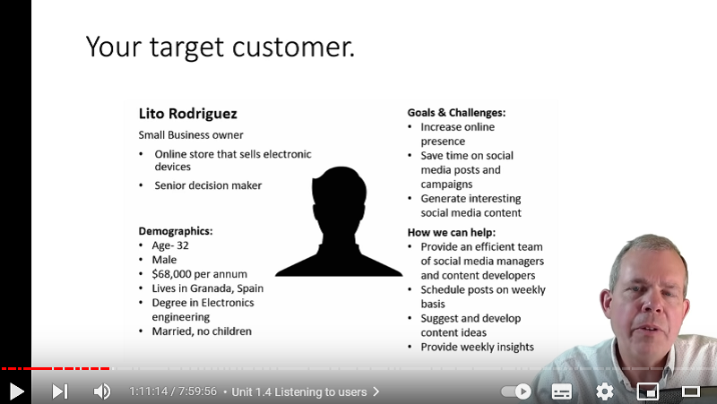
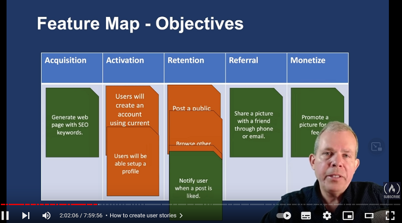

# Business of Building Apps

### Motivations for building an app

<details>
<summary>Motivations for building an app</summary>

<details>
<summary>Motivations</summary>

- Why and app?

```js
// - money
// - save the world
// - improve people life
// - gov work better
// - ...
```

- What problem are you going to solve?

```js
// There's an app for every need, but not a need for every app.
```

- Value proposition

```js
// airBnb => Enable property owners to make money by renting space.
// X is a service that allows Y(cutomer) to do Z in a better way.
```

-App or website ?

```js
// - Majority of people play games App
// - On the other side, they use web brower to navigate through web pages
```

<details>
<summary>Categories of Apps</summary>

```js
// compare to others
// find your customer = make greats app they love to use = money

// augment instead of replace => app improving another Big app

// --- categories ---
// make games, for portfolio
// lifestyle
// utility
// productivity
// shopping => augment rather than compete against Big
// news & informations
// education
```

choosing a category

```js
// 1 - pick something you love = know things you love and gotta do !== harder to solver others problems
// 2 - focus on satisfaction rather than money
// 3 - improve existing app rather than compete against big ones
```

</details>

</details>

<details>
<summary>Find a problem to solve
</summary>

```js
// "An idea that does not fulfill a need is not a business opportunity"
```

```js
// "We divide business plans into three categories: candy, vitamins, and painkillers.
// We throw away the candy.
// We look at vitamins.
// We really luke painkillers.
// We espacially like addictive painkillers."
```

```js
// Candy => fun, wasting time but like it
// Vitamins => cool idea, could probably use it. Nice to have
// Painkillers => need it now, shut up and take my money
```

```js
// seek for higher needs , fullfilment , belonging , recognition , security
```

Five whys

```js
// - why is it happening ? why is that? why is that? why is that? why is that ?
```

</details>

<details>

<summary>Discover a niche</summary>

```js
// low competition
// market demand
// profit potential

 - Follow trends
//  google trends - ex: keywords by year

- Add a twist
// combine features => ex: google map + police check => waze
```

- Improve existing

```js
// compare competitors : popularity , notable features, monetization, company size, update, reviews
// features : gap to fill ?
// monetization : people annoyed ?
// size: competing against Big team or solo programmer ?
// updates: updated good app ?
// poor ratings ? a lot of people but existing bad app
// good ratings ? build similar app/features
```

apps stats

```js
// appannie
// sensorTower
// statista
```

</details>

<details>
<summary>The Elevator pitch - Listen to your users</summary>

```js
// share ideas - ideas are cheap, execution is everything
// find the customers > build something great > make the money
```

- Know your primary user



```js
target customer
// audience exist ? landing page, ads coming soon, email
// feedback, youtube, reddit appIdeas, family, money ? mintel
// "Will they come?"
```

</details>

<details>
<summary>Exercises</summary>

exercise

```js
// Exercise 1
// - Provide 3 useful statements about the app market that would help you in choosing what type of app to produce
// - Describe trends or characteristics that predict either success or failure

// ---

// Exercise 2
// 1 Paragraph => What market category should I compete in if I were to build an application ?
// 1 Page => chart trends found and why focus on this category

// ---

// Exercise 3
// Pb to solve examples
// - How to find a hotel room quickly
// - How to save money while grocery shopping
// - How to visit a destination using a virtual tour guide

// Personal interests or your own work problems
// Persona
// Problems on ideal user ?
// Who is ?
// What does the app do to solve the problem?
// What does the app look like ?
// What competition exists ?
// What makes your idea different from existing solution ?

// Describe the app to your friends
// Get feedback - like / dislike
// What would they change
// 1 to 10: how likely would you be to use this app

// Based on feedback => changes
// Re feedback
// Record insights, figure out what they want

// => 3-5 pages describing and app idea, ideal user, outlines features, suggestions from interviews
```

</details>

</details>

### Design an effective app

<details>
<summary>Design an effective app</summary>

<details>
<summary>Which features</summary>

```js
// 1 - 61% - Easy to use and navigate
// 2 - 34% - New things to explore - addictive
// 3 - 29%
```

```js
// compare to others - feedbacks
```

```js
// users stories
// priorities - hours of work
```

monetize

```js
// Activation (how users find you) => Acquisition (how onboard users) => Retention (main point of your app) => Referral (invite friends)
// - Activation : get a invite
// - Acquisition : create an account
// - Retention : play a game
// - Referral : share a pic
```



</details>

<details>
<summary>What is looks like</summary>

Effective UI

Onboarding

```js
// Effective UI
// Design order: User Needs => Features => UI Views => UX Navigation

// "UI is like a joke"

// "Human interface Guidelines"
```

</details>

<details>
<summary>User Experience</summary>

```js

```

</details>

<details>
<summary>MVP</summary>

```js
// Proven to be necessary
// Easiest to develop
```

</details>

</details>

### Marketing and Monetizing an app

### Building User Loyalty

### Choosing the rights tools

### The Full Stack of technology behind an App

### Hiring a development team

### Emerging Trends in mobile development
